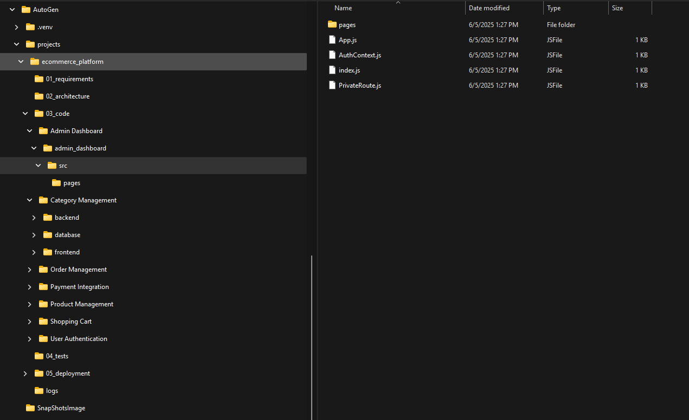
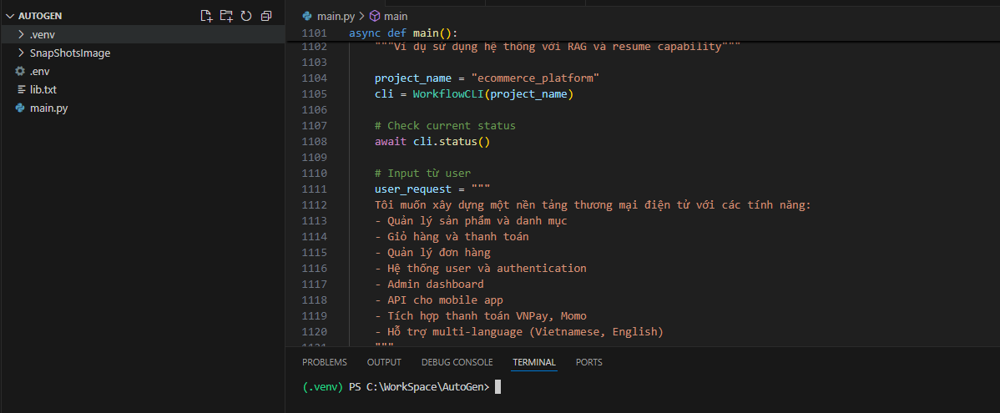
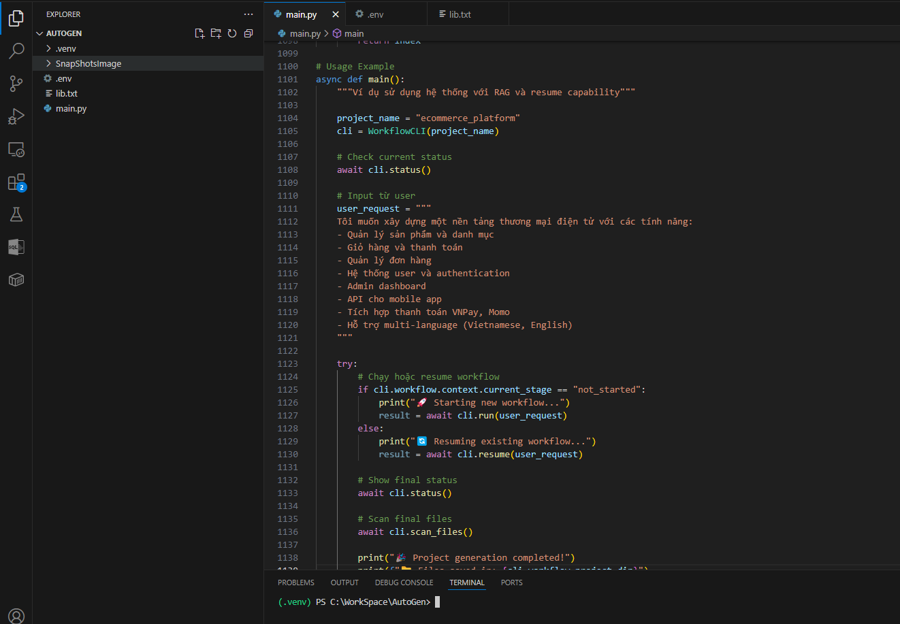
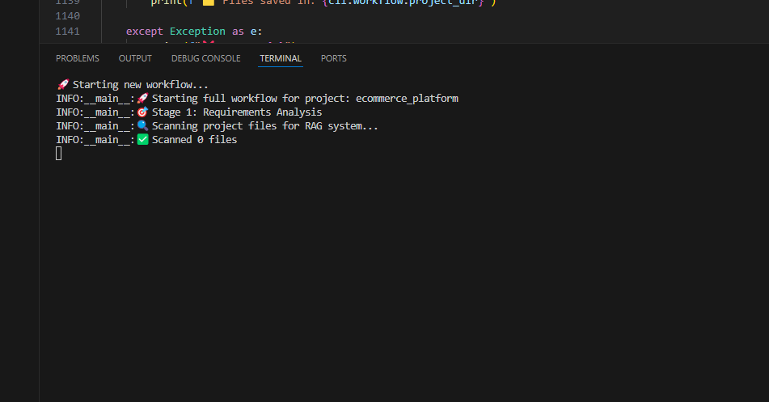
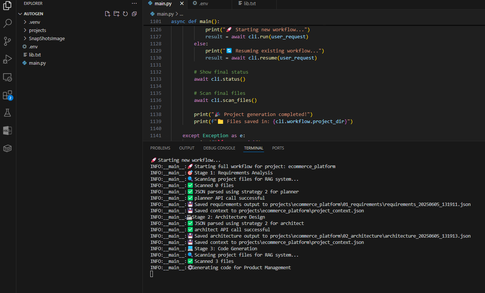
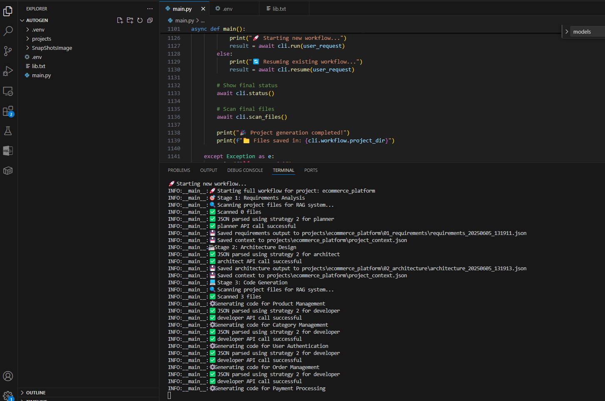
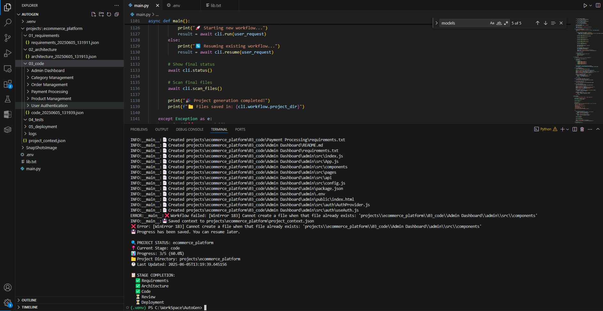
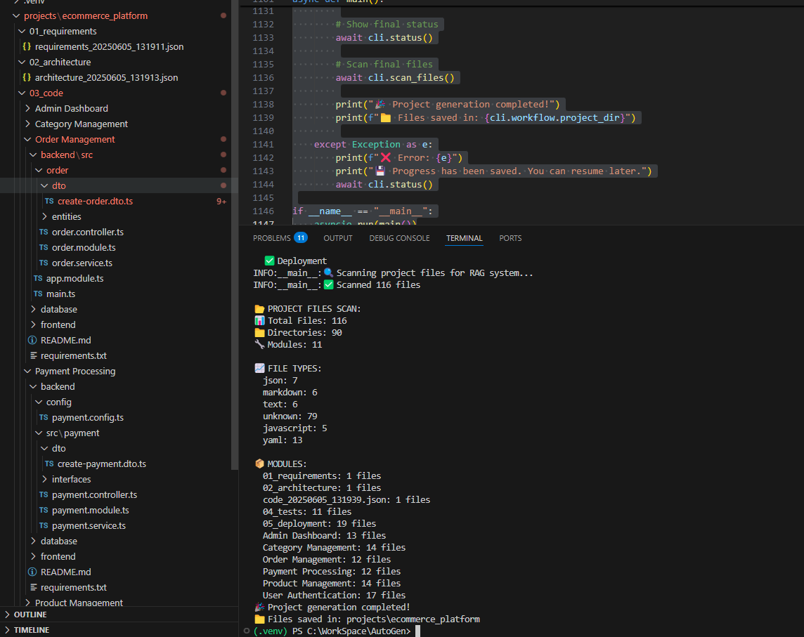

```
(.venv) PS C:\WorkSpace\AutoGen> & C:/WorkSpace/AutoGen/.venv/Scripts/python.exe c:/WorkSpace/AutoGen/version2.py
INFO:__main__:Initialized planner model with API key 1
INFO:__main__:Initialized architect model with API key 2
INFO:__main__:Initialized developer model with API key 3
INFO:__main__:Initialized reviewer model with API key 4
INFO:__main__:Initialized devops model with API key 5
INFO:__main__:📁 Created project structure for ecommerce_platform

🔍 PROJECT STATUS: ecommerce_platform
📍 Current Stage: not_started
📊 Progress: 0/5 (0.0%)
📁 Project Directory: projects\ecommerce_platform
🕐 Last Updated: 2025-06-05T13:25:56.226916

📋 STAGE COMPLETION:
  ⏳ Requirements
  ⏳ Architecture
  ⏳ Code
  ⏳ Review
  ⏳ Deployment
  ⏳ Review
  ⏳ Review
  ⏳ Review
  ⏳ Review
  ⏳ Deployment
🚀 Starting new workflow...
INFO:__main__:🚀 Starting full workflow for project: ecommerce_platform
INFO:__main__:🎯 Stage 1: Requirements Analysis
INFO:__main__:🔍 Scanning project files for RAG system...
INFO:__main__:✅ Scanned 0 files
INFO:__main__:✅ JSON parsed using strategy 2 for planner
INFO:__main__:✅ planner API call successful
INFO:__main__:💾 Saved requirements output to projects\ecommerce_platform\01_requirements\requirements_20250605_132559.json
INFO:__main__:💾 Saved context to projects\ecommerce_platform\project_context.json
INFO:__main__:🏗 Stage 2: Architecture Design
INFO:__main__:✅ JSON parsed using strategy 2 for architect
INFO:__main__:✅ architect API call successful
INFO:__main__:💾 Saved architecture output to projects\ecommerce_platform\02_architecture\architecture_20250605_132601.json
INFO:__main__:💾 Saved context to projects\ecommerce_platform\project_context.json
INFO:__main__:💻 Stage 3: Code Generation
INFO:__main__:🔍 Scanning project files for RAG system...
INFO:__main__:✅ Scanned 3 files
INFO:__main__:⚙️ Generating code for Product Management
INFO:__main__:✅ JSON parsed using strategy 2 for developer
INFO:__main__:✅ developer API call successful
INFO:__main__:⚙️ Generating code for Category Management
INFO:__main__:✅ JSON parsed using strategy 2 for developer
INFO:__main__:✅ developer API call successful
INFO:__main__:⚙️ Generating code for User Authentication
INFO:__main__:✅ JSON parsed using strategy 2 for developer
INFO:__main__:✅ developer API call successful
INFO:__main__:⚙️ Generating code for Order Management
INFO:__main__:✅ JSON parsed using strategy 2 for developer
INFO:__main__:✅ developer API call successful
INFO:__main__:⚙️ Generating code for Payment Integration
INFO:__main__:✅ JSON parsed using strategy 2 for developer
INFO:__main__:✅ developer API call successful
INFO:__main__:⚙️ Generating code for Shopping Cart
INFO:__main__:✅ JSON parsed using strategy 2 for developer
INFO:__main__:✅ developer API call successful
INFO:__main__:⚙️ Generating code for Admin Dashboard
INFO:__main__:✅ JSON parsed using strategy 2 for developer
INFO:__main__:✅ developer API call successful
INFO:__main__:💾 Saved code output to projects\ecommerce_platform\03_code\code_20250605_132742.json
INFO:__main__:📄 Created projects\ecommerce_platform\03_code\Product Management\backend\modules\product\controllers\product.controller.js
INFO:__main__:📄 Created projects\ecommerce_platform\03_code\Product Management\backend\modules\product\models\product.model.js
INFO:__main__:📄 Created projects\ecommerce_platform\03_code\Product Management\backend\modules\product\routes\product.routes.js
INFO:__main__:📄 Created projects\ecommerce_platform\03_code\Product Management\backend\config\db.config.js
INFO:__main__:📄 Created projects\ecommerce_platform\03_code\Product Management\frontend\src\components\Product\ProductList.js
INFO:__main__:📄 Created projects\ecommerce_platform\03_code\Product Management\database\migrations\20240101000001-create-products.js
INFO:__main__:📄 Created projects\ecommerce_platform\03_code\Category Management\backend\modules\category\models\category.model.js
INFO:__main__:📄 Created projects\ecommerce_platform\03_code\Category Management\backend\modules\category\controllers\category.controller.js
INFO:__main__:📄 Created projects\ecommerce_platform\03_code\Category Management\backend\modules\category\routes\category.routes.js
INFO:__main__:📄 Created projects\ecommerce_platform\03_code\Category Management\backend\config\database.js
INFO:__main__:📄 Created projects\ecommerce_platform\03_code\Category Management\frontend\src\components\category\CategoryList.js
INFO:__main__:📄 Created projects\ecommerce_platform\03_code\Category Management\database\migrations\20250605140000-create-categories.js
INFO:__main__:📄 Created projects\ecommerce_platform\03_code\User Authentication\backend\modules\user_authentication\controllers\authController.js
INFO:__main__:📄 Created projects\ecommerce_platform\03_code\User Authentication\backend\modules\user_authentication\models\User.js
INFO:__main__:📄 Created projects\ecommerce_platform\03_code\User Authentication\backend\modules\user_authentication\routes\auth.js
INFO:__main__:📄 Created projects\ecommerce_platform\03_code\User Authentication\backend\config\config.js
INFO:__main__:📄 Created projects\ecommerce_platform\03_code\User Authentication\backend\middleware\auth.js
INFO:__main__:📄 Created projects\ecommerce_platform\03_code\User Authentication\frontend\src\components\auth\Login.js
INFO:__main__:📄 Created projects\ecommerce_platform\03_code\User Authentication\frontend\src\components\auth\Register.js
INFO:__main__:📄 Created projects\ecommerce_platform\03_code\User Authentication\frontend\src\services\authService.js
INFO:__main__:📄 Created projects\ecommerce_platform\03_code\User Authentication\package.json
INFO:__main__:📄 Created projects\ecommerce_platform\03_code\Order Management\backend\order_management\models\order.js
INFO:__main__:📄 Created projects\ecommerce_platform\03_code\Order Management\backend\order_management\models\orderItem.js
INFO:__main__:📄 Created projects\ecommerce_platform\03_code\Order Management\backend\order_management\controllers\orderController.js
INFO:__main__:📄 Created projects\ecommerce_platform\03_code\Order Management\backend\order_management\routes\orderRoutes.js
INFO:__main__:📄 Created projects\ecommerce_platform\03_code\Order Management\src\app.js
INFO:__main__:📄 Created projects\ecommerce_platform\03_code\Order Management\database\config\database.js
INFO:__main__:📄 Created projects\ecommerce_platform\03_code\User Authentication\backend\middleware\auth.js
INFO:__main__:📄 Created projects\ecommerce_platform\03_code\User Authentication\frontend\src\components\auth\Login.js
INFO:__main__:📄 Created projects\ecommerce_platform\03_code\User Authentication\frontend\src\components\auth\Register.js
INFO:__main__:📄 Created projects\ecommerce_platform\03_code\User Authentication\frontend\src\services\authService.js
INFO:__main__:📄 Created projects\ecommerce_platform\03_code\User Authentication\package.json
INFO:__main__:📄 Created projects\ecommerce_platform\03_code\Order Management\backend\order_management\models\order.js
INFO:__main__:📄 Created projects\ecommerce_platform\03_code\Order Management\backend\order_management\models\orderItem.js
INFO:__main__:📄 Created projects\ecommerce_platform\03_code\Order Management\backend\order_management\controllers\orderController.js
INFO:__main__:📄 Created projects\ecommerce_platform\03_code\Order Management\backend\order_management\routes\orderRoutes.js
INFO:__main__:📄 Created projects\ecommerce_platform\03_code\Order Management\src\app.js
INFO:__main__:📄 Created projects\ecommerce_platform\03_code\Order Management\database\config\database.js
INFO:__main__:📄 Created projects\ecommerce_platform\03_code\User Authentication\frontend\src\components\auth\Register.js
INFO:__main__:📄 Created projects\ecommerce_platform\03_code\User Authentication\frontend\src\services\authService.js
INFO:__main__:📄 Created projects\ecommerce_platform\03_code\User Authentication\package.json
INFO:__main__:📄 Created projects\ecommerce_platform\03_code\Order Management\backend\order_management\models\order.js
INFO:__main__:📄 Created projects\ecommerce_platform\03_code\Order Management\backend\order_management\models\orderItem.js
INFO:__main__:📄 Created projects\ecommerce_platform\03_code\Order Management\backend\order_management\controllers\orderController.js
INFO:__main__:📄 Created projects\ecommerce_platform\03_code\Order Management\backend\order_management\routes\orderRoutes.js
INFO:__main__:📄 Created projects\ecommerce_platform\03_code\Order Management\src\app.js
INFO:__main__:📄 Created projects\ecommerce_platform\03_code\Order Management\database\config\database.js
INFO:__main__:📄 Created projects\ecommerce_platform\03_code\User Authentication\package.json
INFO:__main__:📄 Created projects\ecommerce_platform\03_code\Order Management\backend\order_management\models\order.js
INFO:__main__:📄 Created projects\ecommerce_platform\03_code\Order Management\backend\order_management\models\orderItem.js
INFO:__main__:📄 Created projects\ecommerce_platform\03_code\Order Management\backend\order_management\controllers\orderController.js
INFO:__main__:📄 Created projects\ecommerce_platform\03_code\Order Management\backend\order_management\routes\orderRoutes.js
INFO:__main__:📄 Created projects\ecommerce_platform\03_code\Order Management\src\app.js
INFO:__main__:📄 Created projects\ecommerce_platform\03_code\Order Management\database\config\database.js
INFO:__main__:📄 Created projects\ecommerce_platform\03_code\Order Management\backend\order_management\controllers\orderController.js
INFO:__main__:📄 Created projects\ecommerce_platform\03_code\Order Management\backend\order_management\routes\orderRoutes.js
INFO:__main__:📄 Created projects\ecommerce_platform\03_code\Order Management\src\app.js
INFO:__main__:📄 Created projects\ecommerce_platform\03_code\Order Management\database\config\database.js
INFO:__main__:📄 Created projects\ecommerce_platform\03_code\Payment Integration\backend\payment\config\vnpay.config.js
INFO:__main__:📄 Created projects\ecommerce_platform\03_code\Order Management\backend\order_management\routes\orderRoutes.js
INFO:__main__:📄 Created projects\ecommerce_platform\03_code\Order Management\src\app.js
INFO:__main__:📄 Created projects\ecommerce_platform\03_code\Order Management\database\config\database.js
INFO:__main__:📄 Created projects\ecommerce_platform\03_code\Payment Integration\backend\payment\config\vnpay.config.js
INFO:__main__:📄 Created projects\ecommerce_platform\03_code\Order Management\database\config\database.js
INFO:__main__:📄 Created projects\ecommerce_platform\03_code\Payment Integration\backend\payment\config\vnpay.config.js
INFO:__main__:📄 Created projects\ecommerce_platform\03_code\Payment Integration\backend\payment\config\momo.config.js
INFO:__main__:📄 Created projects\ecommerce_platform\03_code\Payment Integration\backend\payment\config\vnpay.config.js
INFO:__main__:📄 Created projects\ecommerce_platform\03_code\Payment Integration\backend\payment\config\momo.config.js
INFO:__main__:📄 Created projects\ecommerce_platform\03_code\Payment Integration\backend\payment\config\momo.config.js
INFO:__main__:📄 Created projects\ecommerce_platform\03_code\Payment Integration\backend\payment\controllers\payment.controller.js
INFO:__main__:📄 Created projects\ecommerce_platform\03_code\Payment Integration\backend\payment\models\payment.model.js
INFO:__main__:📄 Created projects\ecommerce_platform\03_code\Payment Integration\backend\payment\routes\payment.routes.js
INFO:__main__:📄 Created projects\ecommerce_platform\03_code\Payment Integration\backend\payment\models\payment.model.js
INFO:__main__:📄 Created projects\ecommerce_platform\03_code\Payment Integration\backend\payment\routes\payment.routes.js
INFO:__main__:📄 Created projects\ecommerce_platform\03_code\Payment Integration\backend\payment\services\vnpay.service.js
INFO:__main__:📄 Created projects\ecommerce_platform\03_code\Payment Integration\backend\payment\routes\payment.routes.js
INFO:__main__:📄 Created projects\ecommerce_platform\03_code\Payment Integration\backend\payment\services\vnpay.service.js
INFO:__main__:📄 Created projects\ecommerce_platform\03_code\Payment Integration\backend\payment\services\momo.service.js
INFO:__main__:📄 Created projects\ecommerce_platform\03_code\Payment Integration\frontend\src\components\payment\PaymentForm.js
INFO:__main__:📄 Created projects\ecommerce_platform\03_code\Payment Integration\backend\payment\services\vnpay.service.js
INFO:__main__:📄 Created projects\ecommerce_platform\03_code\Payment Integration\backend\payment\services\momo.service.js
INFO:__main__:📄 Created projects\ecommerce_platform\03_code\Payment Integration\frontend\src\components\payment\PaymentForm.js
INFO:__main__:📄 Created projects\ecommerce_platform\03_code\Payment Integration\backend\payment\services\momo.service.js
INFO:__main__:📄 Created projects\ecommerce_platform\03_code\Payment Integration\frontend\src\components\payment\PaymentForm.js
INFO:__main__:📄 Created projects\ecommerce_platform\03_code\Payment Integration\frontend\src\components\payment\PaymentForm.js
INFO:__main__:📄 Created projects\ecommerce_platform\03_code\Payment Integration\frontend\src\services\payment.js
INFO:__main__:📄 Created projects\ecommerce_platform\03_code\Payment Integration\database\migrations\20250605140000_create_payments_table.js
INFO:__main__:📄 Created projects\ecommerce_platform\03_code\Shopping Cart\backend\src\shopping_cart\models\cart.js
INFO:__main__:📄 Created projects\ecommerce_platform\03_code\Shopping Cart\backend\src\shopping_cart\controllers\cartController.js
INFO:__main__:📄 Created projects\ecommerce_platform\03_code\Shopping Cart\backend\src\shopping_cart\routes\cartRoutes.js
INFO:__main__:📄 Created projects\ecommerce_platform\03_code\Shopping Cart\frontend\src\components\ShoppingCart\ShoppingCart.js
INFO:__main__:📄 Created projects\ecommerce_platform\03_code\Shopping Cart\database\migrations\20250605140000-create-shopping-carts.js
INFO:__main__:📄 Created projects\ecommerce_platform\03_code\Shopping Cart\database\migrations\20250605140001-create-cart-items.js
INFO:__main__:📄 Created projects\ecommerce_platform\03_code\Admin Dashboard\admin_dashboard\package.json
INFO:__main__:📄 Created projects\ecommerce_platform\03_code\Admin Dashboard\admin_dashboard\src\index.js
INFO:__main__:📄 Created projects\ecommerce_platform\03_code\Admin Dashboard\admin_dashboard\src\App.js
INFO:__main__:📄 Created projects\ecommerce_platform\03_code\Admin Dashboard\admin_dashboard\src\AuthContext.js
INFO:__main__:📄 Created projects\ecommerce_platform\03_code\Admin Dashboard\admin_dashboard\src\PrivateRoute.js
INFO:__main__:📄 Created projects\ecommerce_platform\03_code\Admin Dashboard\admin_dashboard\src\pages\Dashboard.js
INFO:__main__:📄 Created projects\ecommerce_platform\03_code\Admin Dashboard\admin_dashboard\src\pages\Products.js
INFO:__main__:📄 Created projects\ecommerce_platform\03_code\Admin Dashboard\admin_dashboard\src\pages\Orders.js
INFO:__main__:📄 Created projects\ecommerce_platform\03_code\Admin Dashboard\admin_dashboard\src\pages\Users.js
INFO:__main__:📄 Created projects\ecommerce_platform\03_code\Admin Dashboard\admin_dashboard\src\pages\Login.js
INFO:__main__:🔍 Scanning project files for RAG system...
INFO:__main__:✅ Scanned 57 files
INFO:__main__:💾 Saved RAG index to projects\ecommerce_platform\rag_index.json
INFO:__main__:💾 Saved context to projects\ecommerce_platform\project_context.json
INFO:__main__:🧪 Stage 4: Code Review & Testing
INFO:__main__:🔍 Scanning project files for RAG system...
INFO:__main__:✅ Scanned 58 files
INFO:__main__:✅ JSON parsed using strategy 2 for reviewer
INFO:__main__:✅ reviewer API call successful
INFO:__main__:💾 Saved review output to projects\ecommerce_platform\04_tests\review_20250605_132801.json
INFO:__main__:🧪 Created test file projects\ecommerce_platform\04_tests\test_api.py
INFO:__main__:🧪 Created test file projects\ecommerce_platform\04_tests\test_ui.js
INFO:__main__:🧪 Created test file projects\ecommerce_platform\04_tests\test_auth.py
INFO:__main__:🧪 Created test file projects\ecommerce_platform\04_tests\test_payment.py
INFO:__main__:🧪 Created test file projects\ecommerce_platform\04_tests\test_admin_dashboard.py
INFO:__main__:💾 Saved context to projects\ecommerce_platform\project_context.json
INFO:__main__:🔄 Stage 5: Deployment & DevOps
INFO:__main__:🔍 Scanning project files for RAG system...
INFO:__main__:✅ Scanned 64 files
INFO:__main__:✅ JSON parsed using strategy 2 for devops
INFO:__main__:✅ devops API call successful
INFO:__main__:💾 Saved deployment output to projects\ecommerce_platform\05_deployment\deployment_20250605_132814.json
INFO:__main__:🚀 Created deployment file projects\ecommerce_platform\05_deployment\docker\Dockerfile_backend
INFO:__main__:🚀 Created deployment file projects\ecommerce_platform\05_deployment\docker\Dockerfile_frontend
INFO:__main__:🚀 Created deployment file projects\ecommerce_platform\05_deployment\docker\docker-compose.yml
INFO:__main__:🚀 Created deployment file projects\ecommerce_platform\05_deployment\ci-cd\.github_workflows_deploy.yml
INFO:__main__:🚀 Created deployment file projects\ecommerce_platform\05_deployment\kubernetes\deployment.yaml
INFO:__main__:🚀 Created deployment file projects\ecommerce_platform\05_deployment\kubernetes\service.yaml
INFO:__main__:🚀 Created deployment file projects\ecommerce_platform\05_deployment\kubernetes\ingress.yaml
INFO:__main__:💾 Saved context to projects\ecommerce_platform\project_context.json
INFO:__main__:💾 Saved context to projects\ecommerce_platform\project_context.json
INFO:__main__:🔍 Scanning project files for RAG system...
INFO:__main__:✅ Scanned 72 files
INFO:__main__:💾 Saved RAG index to projects\ecommerce_platform\rag_index.json
INFO:__main__:✅ Workflow completed successfully!
INFO:__main__:📁 Project files saved in: projects\ecommerce_platform

🔍 PROJECT STATUS: ecommerce_platform
📍 Current Stage: completed
📊 Progress: 5/5 (100.0%)
📁 Project Directory: projects\ecommerce_platform
🕐 Last Updated: 2025-06-05T13:28:14.617224

📋 STAGE COMPLETION:
  ✅ Requirements
  ✅ Architecture
  ✅ Code
  ✅ Review
  ✅ Deployment
INFO:__main__:🔍 Scanning project files for RAG system...
INFO:__main__:✅ Scanned 72 files

📂 PROJECT FILES SCAN:
📊 Total Files: 72
📁 Directories: 92
🔧 Modules: 12

📈 FILE TYPES:
  json: 9
  python: 4
  javascript: 52
  yaml: 5
  unknown: 2

📦 MODULES:
  01_requirements: 1 files
  02_architecture: 1 files
  code_20250605_132742.json: 1 files
  04_tests: 6 files
  05_deployment: 8 files
  User Authentication: 9 files
  Admin Dashboard: 10 files
  Category Management: 6 files
  Order Management: 6 files
  Payment Integration: 10 files
  Product Management: 6 files
  Shopping Cart: 6 files
🎉 Project generation completed!
📁 Files saved in: projects\ecommerce_platform
```

## Kết quả

```
projects/
└── ecommerce_platform/
    ├── 01_requirements/
    ├── 02_architecture/
    ├── 03_code/
    ├── 04_tests/
    └── 05_deployment/
```











